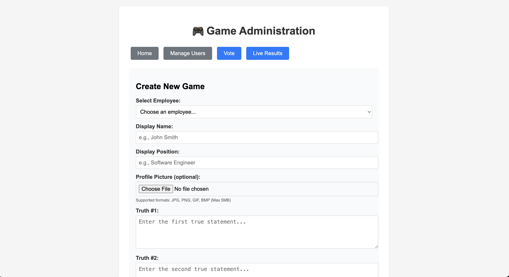
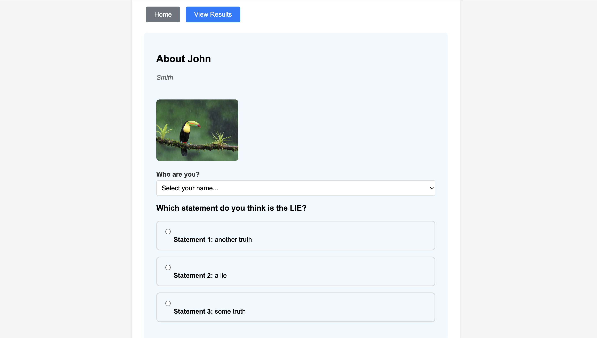
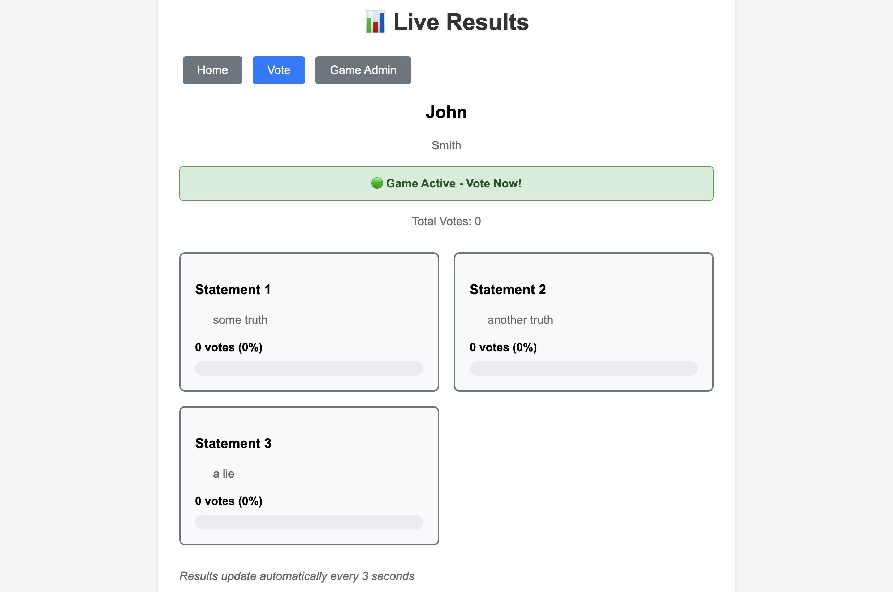
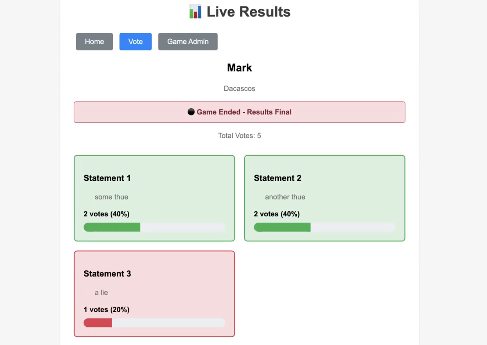

# Truth Sandwich - Two Truths and a Lie Game

A fun Sinatra-based web application for playing "Two Truths and a Lie" with your team!

## Screenshots & Demo

### Game Administration
Create new games with employee pictures and statements:


*Admin interface showing game creation form with profile picture upload*

### Voting Interface
Players vote on which statement they think is the lie:


*Voting page displaying employee photo and three statements to choose from*

### Live Results
Real-time results with automatic updates. **Note**: While the game is active, all statements appear in neutral gray to hide the lie!


*Results page during active voting - lie is hidden with neutral styling*


*Results page after game completion - truths in green, lie in red*

### Demo Video
Watch the full game flow in action:

https://drive.google.com/file/d/1HYwFSmOjT54uvXdr3OMwxdCItKQy-wJC/view?usp=sharing

*Or use the repository video file:*
<video width="800" controls>
  <source src="docs/media/truth-sandwich-demo.webm" type="video/webm">
  <source src="docs/media/truth-sandwich-demo.mp4" type="video/mp4">
  Your browser does not support the video tag.
</video>

## Features

- 🎮 **Game Administration**: Create and manage games for different employees
- �️ **Profile Pictures**: Upload and display employee photos in games and voting
- �🗳️ **Employee Voting**: Team members vote on which statement they think is the lie
- 📊 **Live Results**: Real-time vote tracking with visual progress bars
- 🎯 **Smart Lie Detection**: The lie is only revealed when the game is deactivated
- 👥 **User Management**: Admin interface for managing employees
- 📱 **Responsive Design**: Works great on desktop and mobile devices

## Quick Start with Docker

### Prerequisites
- Docker
- Docker Compose

### Running with Docker Compose (Recommended)

1. **Clone and navigate to the project:**
   ```bash
   git clone <repository-url>
   cd truth-sandwich
   ```

2. **Start the application:**
   ```bash
   docker-compose up -d
   ```

3. **Access the application:**
   - Open your browser to `http://localhost:9292`

4. **Stop the application:**
   ```bash
   docker-compose down
   ```

### Building and Running with Docker Only

1. **Build the Docker image:**
   ```bash
   docker build -t truth-sandwich .
   ```

2. **Run the container:**
   ```bash
   docker run -d \
     --name truth-sandwich-app \
     -p 9292:9292 \
     -v $(pwd)/db:/app/db \
     truth-sandwich
   ```

3. **Stop and remove:**
   ```bash
   docker stop truth-sandwich-app
   docker rm truth-sandwich-app
   ```

### Development Mode

For development with live code reloading:

```bash
docker-compose --profile dev up
```

This will run the app on port 9293 with the code mounted as a volume.

## Running Locally (Without Docker)

### Prerequisites
- Ruby 3.4+
- SQLite3
- Bundler

### Setup

1. **Install dependencies:**
   ```bash
   bundle install
   ```

2. **Set up the database:**
   ```bash
   rake db:create db:migrate db:seed
   ```
   
   This will create the database, run migrations, and populate it with 10 sample users (including 1 admin).

3. **Start the server:**
   ```bash
   rackup
   ```

4. **Access the application:**
   - Open your browser to `http://localhost:9292`

## How to Play

### 1. Set Up Users (Optional - Sample Data Included)
- The app comes with 10 sample users including 1 admin
- Or go to "Manage Users" to add your own team members
- Add their names, emails, and positions

### 2. Create a Game (Admin)
- Navigate to "Game Admin"
- Select an employee and create their game
- Enter their name, position, two truths, and one lie
- The game becomes active automatically

### 3. Vote
- Team members go to "Vote"
- They can see the employee's photo (if uploaded)
- Select their name and vote for which statement they think is the LIE
- Each person can only vote once per game

### 4. View Results
- Go to "Live Results" to see real-time voting
- Results update automatically every 3 seconds
- **Smart Lie Detection**: While the game is active, all statements appear neutral
- Once the admin deactivates the game, the lie is revealed with color coding
- Truth statements appear in green, the lie appears in red

## Application Structure

```
├── app/
│   ├── controllers/          # Sinatra controllers
│   ├── models/              # ActiveRecord models
│   └── views/               # ERB templates
├── config/                  # Configuration files
├── db/                      # Database and migrations
├── public/                  # Static assets (CSS, JS)
├── Dockerfile              # Docker container definition
├── docker-compose.yml      # Docker Compose configuration
└── config.ru              # Rack configuration
```

## API Endpoints

- `GET /` - Home page
- `GET /users` - User management (CRUD)
- `GET /games` - Game administration
- `GET /voting` - Voting interface
- `GET /results` - Live results
- `GET /results/api` - JSON API for live updates

## Environment Variables

- `RACK_ENV` - Environment (development/production)
- `DATABASE_URL` - Database connection string

## Database

The application uses SQLite3 with the following main tables:
- `users` - Employee information
- `games` - Game instances with statements
- `votes` - Individual votes (prevents duplicates)

## Contributing

1. Fork the repository
2. Create a feature branch
3. Make your changes
4. Test with Docker: `docker-compose up`
5. Submit a pull request

## License

[Add your license information here]
